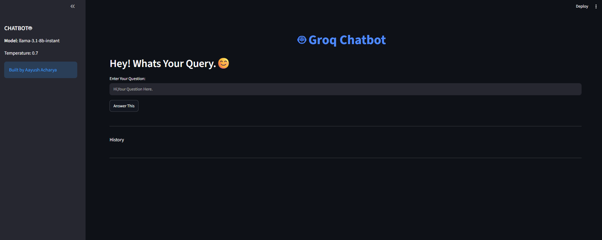
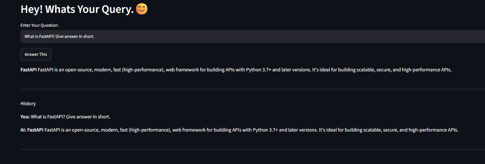
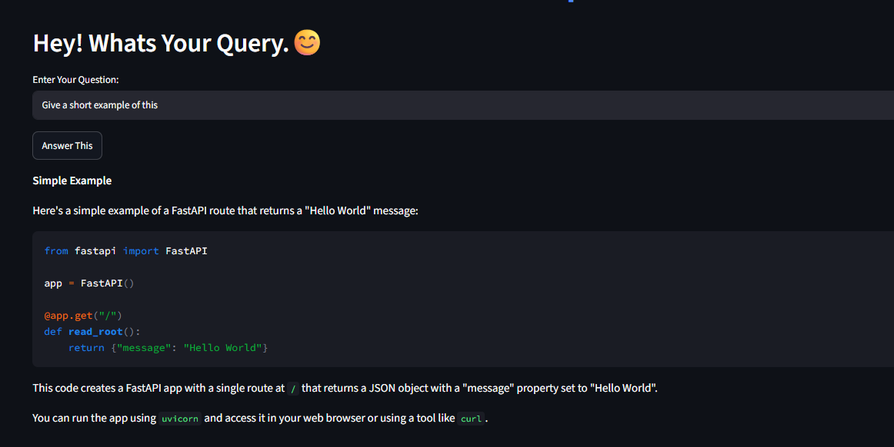
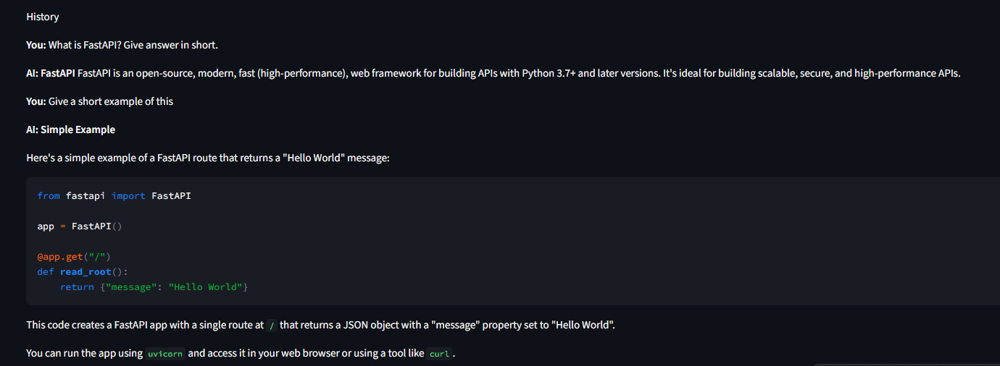

# 🤖 Groq Conversational Chatbot with Memory (Streamlit + LangChain)


A **conversational AI chatbot** built using **Streamlit**, **LangChain LCEL**, and **GROQ LLM (LLaMA 3.1 8B Instant)**.
This chatbot supports **chat memory using `RunnableWithMessageHistory`**, allowing it to remember previous conversations within a session.

---

## Features

*  Conversational chatbot with memory
*  Context-aware responses using chat history
*  Fast inference with GROQ LLM
*  Interactive Streamlit UI
*  LangChain LCEL-based pipeline
*  Session-based chat history storage
*  Clean and beginner-friendly architecture

---

##  Tech Stack

* Python
* Streamlit
* LangChain (LCEL + Runnables)
* GROQ API
* dotenv
* InMemoryChatMessageHistory

---

## Project Structure

```text id="h3qk9m"
.
├── app.py              # Main Streamlit application
├── .env                # GROQ API key
├── requirements.txt    # Dependencies
└── README.md           # Documentation
```

---
##  How It Works

### Chat Flow Architecture

```text id="q9k2lx"
User Input
   ↓
Streamlit UI
   ↓
ChatPromptTemplate
   ↓
RunnableWithMessageHistory
   ↓
GROQ LLM (LLaMA 3.1)
   ↓
Response Parser
   ↓
Output Display
```

---

## Memory System (Important Concept)

This project uses:

### `InMemoryChatMessageHistory`

Stores conversation like:

```text id="m8xk1p"
Human: My name is Aayush
AI: Nice to meet you
```

---

###  `RunnableWithMessageHistory`

It automatically:

* Retrieves session history
* Injects it into the prompt
* Maintains context across messages

Example:

```python id="v2k9qp"
chain_with_history = RunnableWithMessageHistory(
    chain,
    get_session_history,
    input_messages_key="input",
    history_messages_key="history"
)
```
## 📸 Screenshots

  <div>
  UI</div>
  Question 1:
  Question 2:
  Image With History:

---

##  Environment Setup

Create a `.env` file:

```env id="k8q1we"
GROQ_API=your_groq_api_key
```

---

## ▶️ Installation & Run

### 1️⃣ Clone repo

```bash id="z1p4xx"
git clone <repo-url>
cd <repo-name>
```

### 2️⃣ Create environment

```bash id="x9q1aa"
python -m venv myenv
```

### 3️⃣ Activate environment

**Windows**

```bash id="l2p8kk"
myenv\Scripts\activate
```

**Mac/Linux**

```bash id="p0q8mm"
source myenv/bin/activate
```

### 4️⃣ Install dependencies

```bash id="t8q3ww"
pip install -r requirements.txt
```

### 5️⃣ Run app

```bash id="r1k9zz"
streamlit run app.py
```

---

##  Example Conversation

### User:

```text id="u1q9aa"
My name is Aayush
```

### AI:

```text id="s9q2dd"
Nice to meet you, Aayush!
```

### User:

```text id="d8q1ff"
What is my name?
```

### AI:

```text id="k3q9hh"
Your name is Aayush.
```

---

## Key Learning Outcomes

This project helps you understand:

* How chat memory works in LLM apps
* Runnable architecture in LangChain
* Session-based conversation handling
* Prompt engineering with context
* Building real-time AI web apps using Streamlit
* Integration of GROQ LLM APIs

---

## Future Improvements

*  Add persistent database memory (SQLite / Redis)
*  Add PDF-based RAG support
*  Streaming responses
*  Multi-user chat support
*  Chat analytics dashboard
*  User authentication system

---

## 👨‍💻 Author

**Aayush Acharya**

BSc CSIT Student | AI & LLM Developer
Focused on building projects in **LangChain, RAG, and Agentic AI systems**

---
